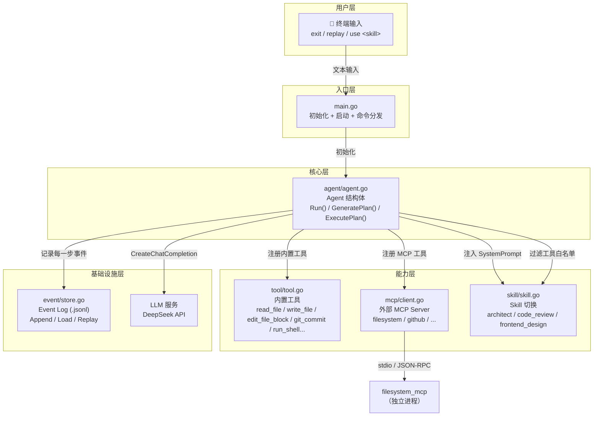
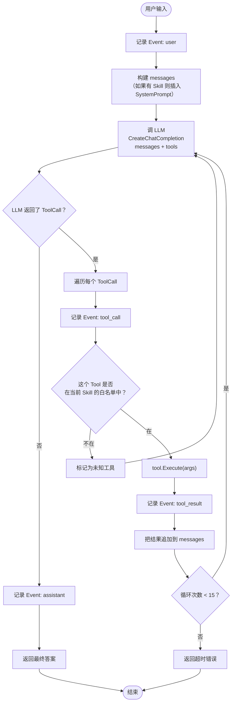
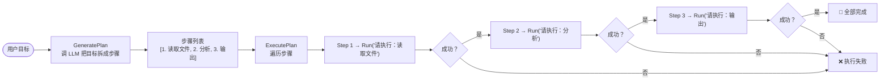
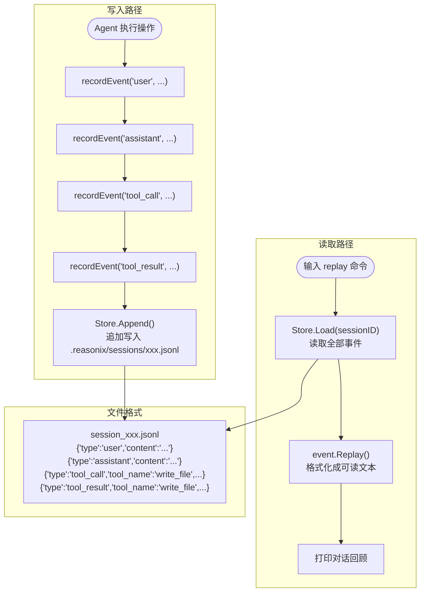
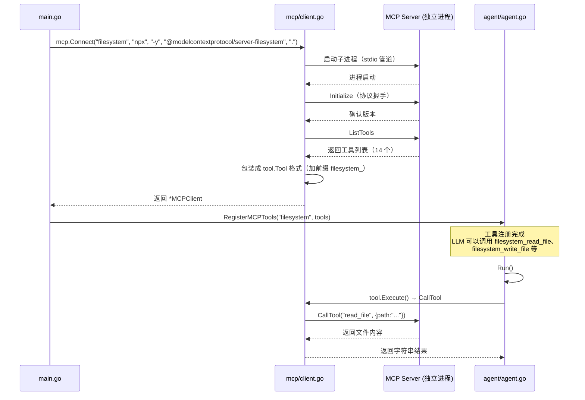
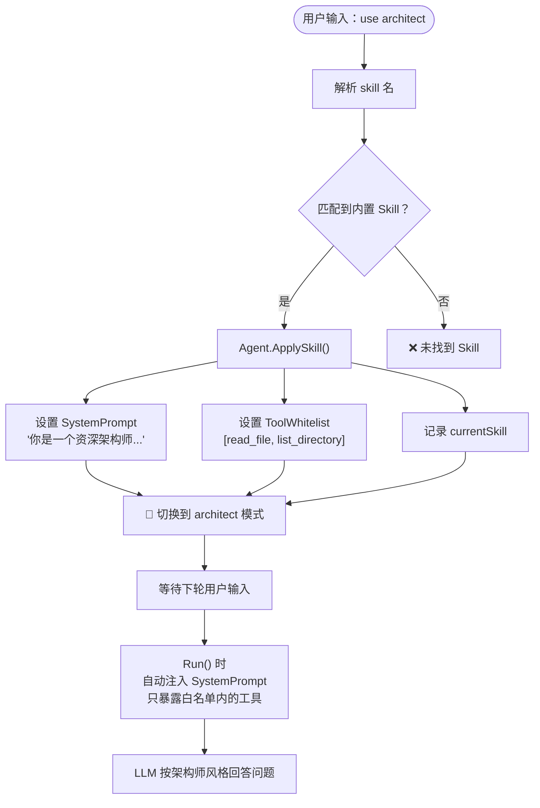
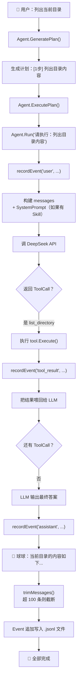
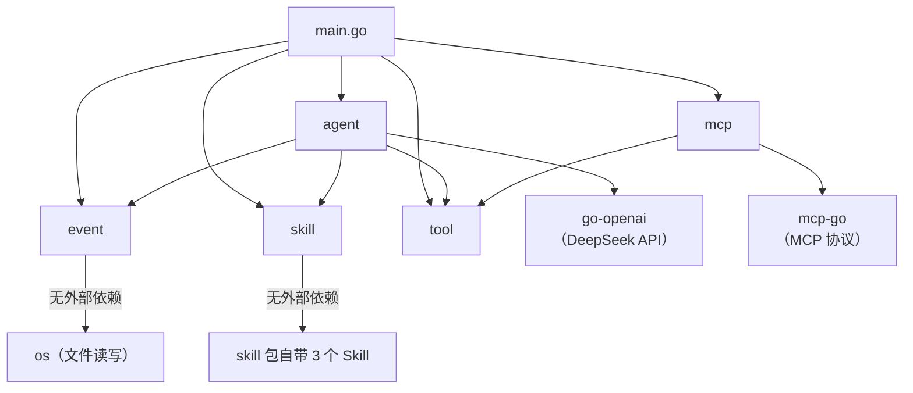
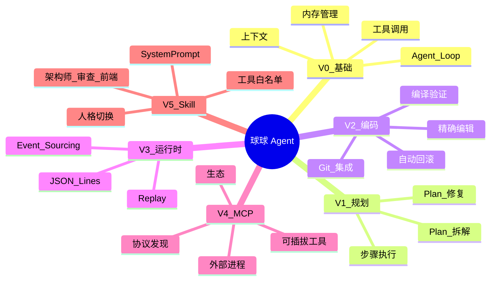

# 🏀 球球 Agent 系统架构总图

> 从 Phase 0 到 V5 的完整知识图谱，一张图看懂整个开发流程。

---

## 一、整体架构分层

---

## 二、Agent 核心循环（Run 函数）

---

## 三、Planning 流程

---

## 四、事件存储与重放（Runtime）

---

## 五、MCP 集成流程

---

## 六、Skill 切换机制

---

## 七、完整调用链（一次典型对话）

---

## 八、包依赖关系

---

## 九、知识图谱一览

---

> 这份图谱覆盖了球球从 Phase 0 到 V5 的全部核心概念和流程。优化阶段（路线一）和阅读 Reasonix 源码（路线二）时，可以随时回到这张图定位自己当前在看哪一层。
