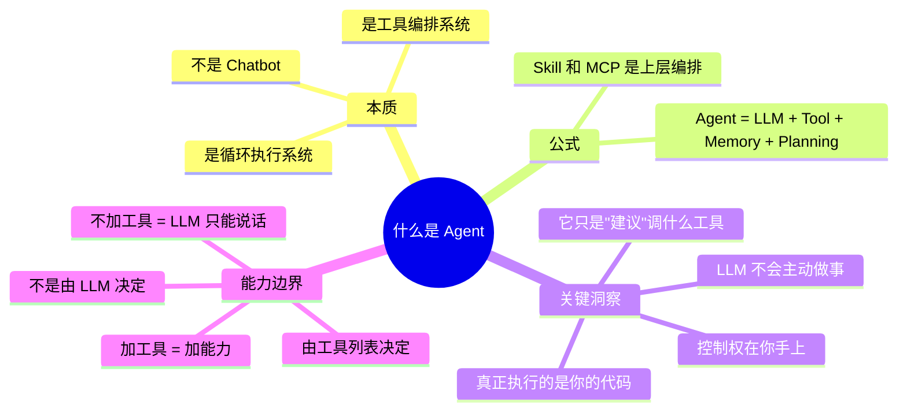
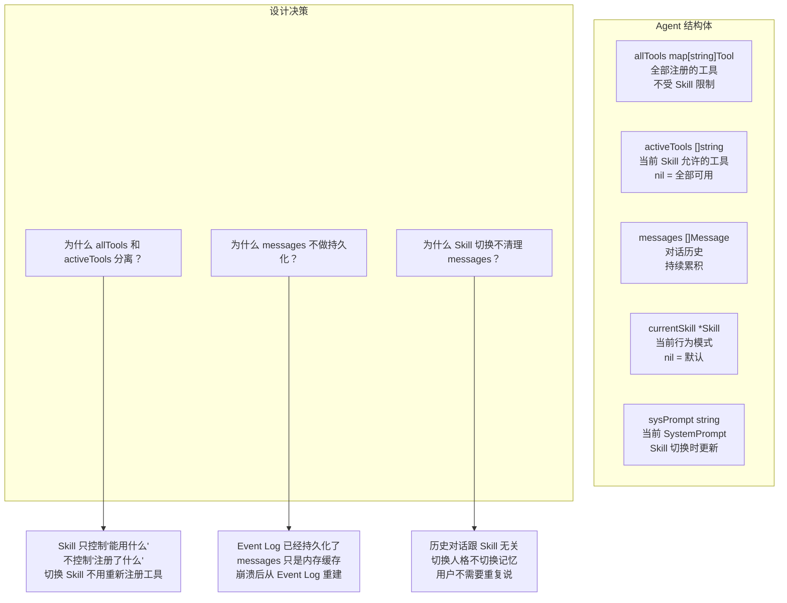
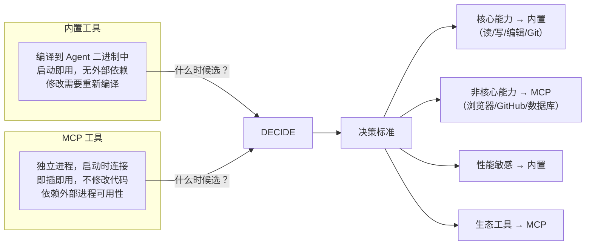
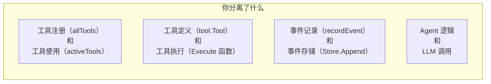
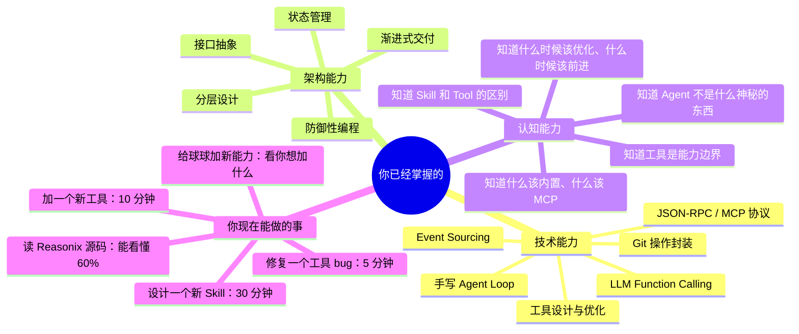

# 🏀 球球 Agent 系统知识图谱（深度版）

> 不是流程图，不是结构图，是**设计决策图谱**。
> 每个节点回答：为什么这么选？有什么权衡？跟什么相关？

---

## 一、核心认知层（你真正理解了这些才算入门）



---

## 二、架构分层与各层设计决策

### 入口层（main.go）

| 维度 | 你的选择 | 其他方案 | 为什么这么选 |
|------|---------|---------|------------|
| 交互方式 | CLI 交互式循环 | HTTP API / WebSocket / IPC | 开发阶段 CLI 最快，调试最方便 |
| 命令格式 | 自然语言 + 少数命令（exit/replay/use） | 全结构化命令 / 纯自然语言 | 用户友好 + 调试可操作 |
| 启动方式 | 单进程，一次性初始化 | 常驻服务 / Server-Client 分离 | 原型阶段单进程最简单 |

**你的代码：** main.go ~50 行，只做初始化 + 命令分发。

---

### 核心层（agent）



### 核心层的三个关键设计

#### 1. Run() 循环——为什么是 for+break 而不是递归？

```
你的选择：for 循环 + break
其他方案：递归调用 / 事件驱动 / 状态机

原因：
- for 循环最简单，一眼能看到循环边界
- 递归有栈溢出风险（15 层以上）
- 状态机是过度设计（你的 Loop 不需要复杂状态转移）
- 事件驱动是异步的，但你每次都要等 LLM 返回才能继续
```

#### 2. maxLoops=15 的考虑

```
为什么不是 5？   复杂任务可能需要 10+ 步
为什么不是 50？  token 消耗线性增长，15 步已经能完成绝大部分任务
怎么判断？      V2 测试中看到 shell 命令失败重试 3 次正常
```

#### 3. 为什么每次请求都带全部历史？

```
你的方案：每次全量发送 messages
其他方案：只发送最近的 N 条 / 压缩历史后发送

权衡：
- 全量发送：LLM 上下文最完整，但 token 消耗大
- 截断发送：省 token，但 LLM 可能丢失关键上下文
- 你的选择是：先保证正确性，token 优化留到以后

你做到的事：
- 当前用 maxMessages=100 做硬截断
- 未来可以优化为：基于 token 数的滑动窗口
```

---

### 工具层（tool）

#### 内置工具分析

| 工具 | 解决的问题 | 设计关键 | 跟 Reasonix 的对应 |
|------|-----------|---------|-------------------|
| read_file | LLM 不能直接访问文件系统 | 返回值友好，失败时给提示 | Tool 层的基础 Reader |
| write_file | LLM 不能直接保存 | 返回字节数，让 LLM 知道写入结果 | Tool 层的基础 Writer |
| list_directory | LLM 不知道项目结构 | 区分文件/目录，带大小信息 | 对应 Aider 的 Repo Map |
| edit_file_block | 精确改代码，不是整文件替换 | **找不到或找到多处就拒绝** | 对应 Claude Code 的 Edit |
| git_commit | 让修改可追溯 | 自动 git add . | 对应 Aider 的自动 Commit |
| count_file_chars | 统计字符数 | 避免 LLM 自己写 shell 命令 | 专注的小工具 |
| run_shell | 兜底：上面都搞不定时用 | 描述里写"优先用其他工具" | 对应 Claude Code 的 bash 工具 |

#### 工具设计的核心原则（你在 V0 第 3 周总结的）

```
① 命名即文档 — LLM 一看就知道什么时候用它
② 参数越少越好 — 1-2 个参数，LLM 填错概率最低
③ 返回值对 LLM 友好 — 不是给人看的，是给 LLM 看的

你比这个原则多走了一步：
④ 专用工具 > 通用工具 — list_directory 比 run_shell("dir") 好
⑤ 失败时给建议 — "文件 xxx 不存在" 比 "no such file" 好
```

#### MCP 工具 vs 内置工具的权衡



---

### 运行时层（event）

#### Event 存储——为什么是 JSON Lines？

| 维度 | JSON Lines（你的选择） | SQLite | 全内存 |
|------|----------------------|--------|--------|
| 实现复杂度 | 15 行代码 | 50+ 行代码 | 0 行 |
| 可读性 | 记事本直接看 | 需要 SQLite 工具 | 看不到 |
| 追加性能 | 秒级 | 秒级 | 秒级 |
| 查询性能 | 全量扫描 | 索引查询 | 全量扫描 |
| 改结构 | 加字段就行 | 要 ALTER TABLE | 重启就丢 |

**你的场景分析：**
```
日活：自己开发用，几轮对话
日事件量：< 200 条
查询模式：只看全部（Replay），从不按条件查
需求：先跑通，再优化

→ JSON Lines 是最务实的选择
→ 跟 Reasonix 的做法一致
```

#### Event 的类型设计

```
你定义了 5 种类型：
  user          — 谁说了什么
  assistant    — LLM 回复了什么
  tool_call    — LLM 要求调什么工具、传了什么参数
  tool_result  — 工具返回了什么
  error        — 哪里出错了

你故意没做的：
  system 类型 — 因为 sysPrompt 不在 Event 里
  checkpoint — V3 只有 Event，还没有快照

跟 Reasonix 对比：
  Reasonix 的 Event 类型跟你几乎一样
  只是它多了 checkpoint 和 metadata
  你的 Event 时机上可以兼容 Reasonix 的格式
```

---

### MCP 层

#### MCP 的核心价值

```
不是技术难度（JSON-RPC 很简单）
而是生态标准：
  ① 统一的工具发现机制（ListTools）
  ② 统一的调用接口（CallTool）
  ③ 语言无关（Server 可以用任何语言写）
  ④ 进程隔离（Server 崩溃不影响 Agent）
```

#### 你的 MCP 实现 vs 官方 SDK

| 你的实现 | 官方 mcp-go SDK |
|---------|----------------|
| 自己调 JSON-RPC | 封装了握手、工具发现 |
| 约 80 行代码 | 几千行 |
| 理解了协议本质 | 功能更全 |
| 够用 | 生产级 |

```
你的选择是对的：
V4 阶段自己实现 MCP Client 比用 SDK 更值
因为你亲手看到了 JSON-RPC 的 request/response
理解了"协议就是消息格式"这件事
```

---

### Skill 层

#### Skill 的本质

```
Skill = SystemPrompt + ToolWhitelist + Rules

不是插件（MCP 才是）
不是新工具（tool 才是）
是 Agent 的"行为配置"

切换 Skill = 换提示词 + 限制工具
不改代码，不重启进程
```

#### Skill 的三个内置模式

| Skill | SystemPrompt 要求 | 工具限制 | 跟 Claude Code 的对应 |
|-------|------------------|---------|---------------------|
| architect | 分析、比较方案、ADR | 只读工具 | Claude Code 的 /plan |
| code_review | 标严重级别、影响分析 | 读 + 编辑 | Claude Code 审查代码时的行为 |
| frontend_design | 组件拆分、a11y、响应式 | 读 + 写 | 没有直接对应 |

#### Skill vs MCP —— 两个正交维度

```mermaid
graph LR
    subgraph Skill 维度——怎么做事
        S1["架构师 → 先分析再动手"]
        S2["代码审查 → 挑错为主"]
        S3["前端设计 → 关注 UI"]
    end
    subgraph MCP 维度——用什么做
        M1["filesystem → 读写文件"]
        M2["github → 管理仓库"]
        M3["browser → 操作浏览器"]
    end

    S1 --- M1
    S1 --- M2
    S2 --- M1
    S3 --- M1
    S3 --- M3

    NOTE["两者正交<br/>架构师也能用 GitHub 工具<br/>审查模式也能用 filesystem"]
```

---

## 三、你学到的核心设计模式

### 模式一：分层与分离



### 模式二：防御性设计

```
你在 6 个地方加了保护：
1. maxLoops=15          → 防止无限循环烧 token
2. maxMessages=100      → 防止内存溢出
3. edit_file_block 唯一检查 → 防止改错位置
4. ToolWhitelist        → Skill 限制工具范围
5. Event Log 追加写     → 不会破坏已有数据
6. JSON Lines 每行独立  → 读一半崩溃也不丢数据
```

### 模式三：渐进式交付

```
V0 不追求完美，只追求跑通
V1 不追求规划最优，只追求能拆步骤
V2 不追求编辑器级体验，只追求能改代码
V3 不追求工业级持久化，只追求有日志
V4 不追求完整 MCP 生态，只追求能接一个
V5 不追求 Skill 自动发现，只追求手动切换

每一轮只解决一个问题。
剩下的问题下一轮解决，或者留到优化阶段。
```

---

## 四、你现在的位置



---

> 这个版本不再只是"画调用流程"，而是记录了**每个设计决策的上下文、权衡、和你的思考过程**。
>
> 下一阶段（路线一优化）和读 Reasonix 源码时，你会发现：
> - 优化：你知道该改什么，因为你知道当时为什么没做到最好
> - 读 Reasonix：你知道该看什么，因为你知道自己的实现跟它的差距在哪
